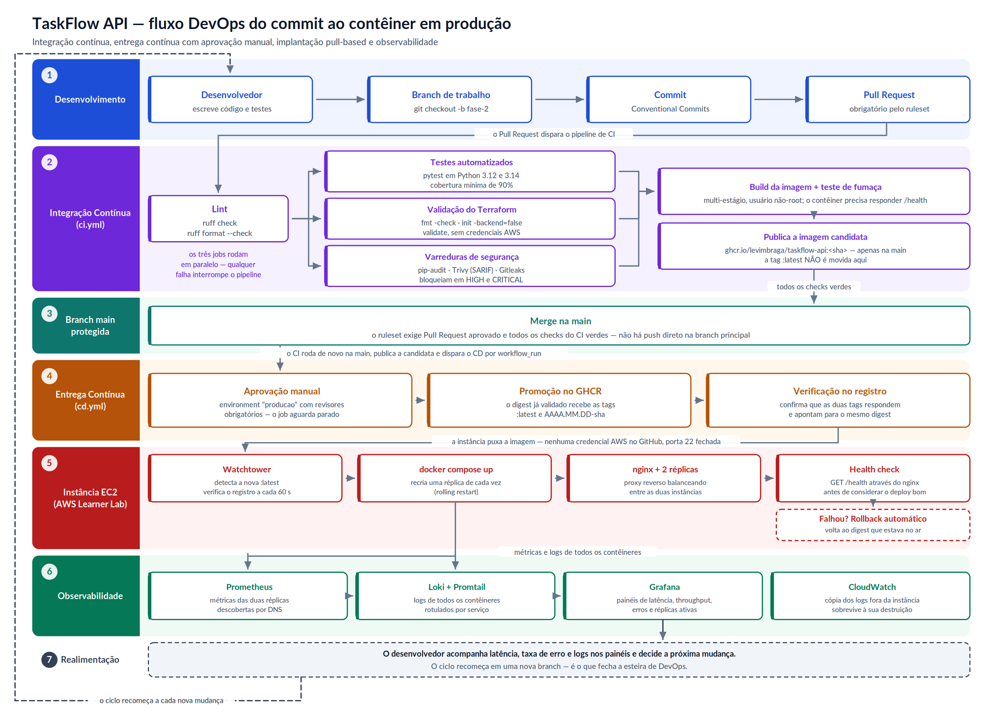

# TaskFlow API — DevOps na Prática (PUCRS)

Pipeline completo de **integração contínua**, **entrega contínua**, **containerização
com orquestração** e **observabilidade** para uma API REST em Python.


| Fase | Entrega |
|---|---|
| **Fase 1** | Pipeline de CI, testes automatizados e infraestrutura como código |
| **Fase 2** | Varreduras de segurança, pipeline de CD, orquestração em contêineres e observabilidade |

---

## 1. Sobre o projeto

A **TaskFlow API** é uma API REST de gerenciamento de tarefas construída com
FastAPI. A aplicação é propositalmente enxuta: o objeto de estudo desta
disciplina é a *esteira* que leva o código do commit até a nuvem, não a regra de
negócio. Ainda assim, a API é funcional e coberta por testes, o que a torna um
alvo realista para o pipeline.

### Endpoints

| Método | Rota | Descrição |
|---|---|---|
| `GET` | `/health` | Health check consumido pelo Docker, pelo nginx e pelo teste de fumaça pós-deploy |
| `GET` | `/metrics` | Métricas no formato Prometheus (latência, throughput e erros por rota) |
| `GET` | `/tasks` | Lista tarefas, com filtro opcional `?completed=true` ou `?completed=false` |
| `GET` | `/tasks/{id}` | Detalha uma tarefa |
| `POST` | `/tasks` | Cria uma tarefa |
| `PATCH` | `/tasks/{id}` | Atualização parcial |
| `DELETE` | `/tasks/{id}` | Remove uma tarefa |
| `GET` | `/docs` | Documentação interativa (Swagger UI) |

---

## 2. O fluxo completo



Em uma frase: **o Pull Request dispara o CI; um CI verde na `main` publica uma
imagem candidata; uma aprovação humana promove essa imagem a `:latest`; e a
instância EC2 puxa a novidade sozinha.** Nenhuma credencial da AWS existe no
GitHub e a porta 22 permanece fechada — a justificativa está na
[seção 7](#7-pipeline-de-entrega-contínua).

---

## 3. Como executar localmente

### 3.1 Só a aplicação

```bash
git clone https://github.com/levimbraga/taskflow-api.git
cd taskflow-api

python3 -m venv .venv && source .venv/bin/activate
pip install -r requirements-dev.txt

uvicorn app.main:app --reload
# Acesse http://localhost:8000/docs
```

### 3.2 A stack completa em contêineres

Sobe as duas réplicas da API atrás do nginx, mais Prometheus, Grafana, Loki e
Promtail:

```bash
./scripts/deploy-stack.sh --build     # constrói a imagem localmente e sobe tudo
```

| Endereço | Serviço |
|---|---|
| <http://localhost> | Aplicação, através do proxy reverso |
| <http://localhost:3000> | Grafana (`admin` / `admin` no ambiente local) |
| <http://localhost:9090> | Prometheus |

Para derrubar:

```bash
./scripts/stack-down.sh               # preserva os volumes de dados
./scripts/stack-down.sh --volumes     # apaga também as séries e os logs
```

### 3.3 Scripts de automação

Os mesmos scripts rodam na sua máquina e dentro do pipeline — nada de comandos
duplicados no YAML que só existem no CI.

```bash
./scripts/lint.sh            # ruff check + ruff format --check
./scripts/test.sh            # pytest com cobertura mínima de 90%
./scripts/build.sh           # build da imagem + teste de fumaça no contêiner
./scripts/security-scan.sh   # pip-audit + Trivy + Gitleaks
./scripts/deploy-stack.sh    # sobe a stack de contêineres, com rollback automático
./scripts/stack-down.sh      # derruba a stack
./scripts/deploy.sh          # terraform init/validate/plan/apply
./scripts/destroy.sh         # derruba a infraestrutura na AWS (use ao encerrar!)
```

---

## 4. Containerização e orquestração

### 4.1 A imagem

O [`Dockerfile`](Dockerfile) usa **build multi-estágio**: o primeiro estágio
instala as dependências em `/install`, o segundo copia apenas o resultado. As
ferramentas de compilação ficam para trás, e a imagem final tem **244 MB** sobre
uma base `python:3.12-slim` de 190 MB.

Endurecimento aplicado:

- usuário **não-root** (`appuser`, uid 1000) criado no próprio Dockerfile;
- `HEALTHCHECK` interno, que o Compose usa para marcar a réplica como saudável;
- no Compose, `read_only: true`, `cap_drop: ALL`, `no-new-privileges` e um
  `tmpfs` em `/tmp` para o que precisa ser escrito.

### 4.2 A stack

O [`docker-compose.yml`](docker-compose.yml) orquestra seis serviços, mais o
Watchtower no profile `deploy`:

| Serviço | Imagem | Papel |
|---|---|---|
| `app` (×2) | construída pelo pipeline | A API, em duas réplicas (`deploy.replicas: 2`) |
| `nginx` | `nginx:1.27-alpine` | Proxy reverso e balanceador entre as réplicas |
| `prometheus` | `prom/prometheus:v3.1.0` | Coleta de métricas |
| `grafana` | `grafana/grafana:11.5.1` | Painéis, provisionados por código |
| `loki` | `grafana/loki:3.3.2` | Armazenamento dos logs |
| `promtail` | `grafana/promtail:3.3.2` | Coleta dos logs dos contêineres |
| `watchtower` | `containrrr/watchtower:1.7.1` | Recebe as entregas (profile `deploy`) |

### 4.3 O detalhe que faz o balanceamento funcionar

Um bloco `upstream` estático faria o nginx resolver o nome `app` **uma única
vez**, na inicialização, e fixar todo o tráfego em uma só réplica. Para
distribuir de verdade é preciso apontar o resolver interno do Docker e usar uma
variável no `proxy_pass`, o que força a reresolução do DNS:

```nginx
resolver 127.0.0.11 valid=10s ipv6=off;

location / {
    set $backend "app:8000";
    proxy_pass http://$backend;
}
```

Verificação com 40 requisições em `/health` através do nginx, medidas pelo
Prometheus por instância:

```
172.20.0.2:8000  ->  20 requisições
172.20.0.7:8000  ->  22 requisições
```

---

## 5. Observabilidade

Três camadas, todas provisionadas por código — não há nenhum painel criado a
mão pela interface.

| Camada | Como funciona |
|---|---|
| **Métricas** | A aplicação expõe `/metrics` via `prometheus-fastapi-instrumentator`. O Prometheus descobre **as duas réplicas** por DNS (`dns_sd_configs`), sem precisar saber os IPs |
| **Logs** | O Promtail lê os logs de todos os contêineres pelo socket do Docker e os rotula por serviço; o Loki os armazena e o Grafana os consulta |
| **Painéis** | O Grafana provisiona os dois datasources e um dashboard de **6 painéis**: requisições por segundo, latência p95, taxa de erro 5xx, réplicas ativas, requisições em andamento e logs da aplicação |
| **CloudWatch** | Na EC2, o agente replica os logs dos contêineres para um log group, dando uma cópia que sobrevive à destruição da instância |

O `/metrics` **não** é acessível de fora: o Prometheus raspa `app:8000`
diretamente pela rede interna, então o nginx recusa a rota por completo
(`403`).

---

## 6. Segurança

### 6.1 No pipeline

O job `security` do CI roda em paralelo com os testes e com a validação do
Terraform, e bloqueia o `build`:

| Ferramenta | Superfície | Critério de falha |
|---|---|---|
| `pip-audit` | Dependências de `requirements.txt` | Qualquer vulnerabilidade conhecida |
| **Trivy** | Sistema operacional e bibliotecas da imagem | `HIGH` ou `CRITICAL` **com correção disponível** (`--ignore-unfixed`) |
| **Gitleaks** | Histórico completo de commits | Qualquer segredo detectado |

O resultado do Trivy é publicado em **SARIF na aba Security** do repositório,
onde cada achado vira um alerta rastreável. As actions são fixadas por versão
(`@v4`, `@v0.36.0`) — referenciar `@master` faria o pipeline executar código de
terceiros que pode mudar sem aviso.

As mesmas três varreduras rodam localmente com `./scripts/security-scan.sh`.

### 6.2 Na aplicação e na infraestrutura

- **nginx**: `X-Content-Type-Options`, `X-Frame-Options`, `Referrer-Policy`,
  `Content-Security-Policy`, `server_tokens off`, corpo limitado a 1 MB e
  *rate limiting* de 30 r/s com burst de 20 (responde `429`, não `503`);
- **contêiner**: sistema de arquivos raiz somente leitura, todas as capabilities
  do kernel removidas, sem escalonamento de privilégios, execução como não-root;
- **AWS**: volume EBS e bucket S3 criptografados, IMDSv2 obrigatório, bloqueio
  total de acesso público no S3, SSH desabilitado por padrão;
- **painéis**: Grafana (3000) e Prometheus (9090) só respondem para o CIDR
  informado em `observability_ingress_cidr`, cujo padrão `127.0.0.1/32` mantém
  as portas fechadas. Uma `validation` no Terraform **rejeita** `0.0.0.0/0`;
- **senha do Grafana**: variável `sensitive = true`, sem valor padrão, escrita
  na instância num `.env` com permissão `600`.

---

## 7. Pipeline de Entrega Contínua

Definido em [`.github/workflows/cd.yml`](.github/workflows/cd.yml).

### 7.1 Por que o deploy é *pull-based*

O projeto roda no AWS Academy Learner Lab, cujas credenciais são **de sessão**:
expiram a cada `Start Lab` e trazem um `AWS_SESSION_TOKEN` novo. Não existe
credencial estável para guardar em `secrets` do GitHub, e o laboratório também
não permite criar a IAM role que o OIDC exigiria. Um pipeline que fizesse
`aws ssm send-command` ou abrisse SSH para o runner quebraria a cada nova sessão.

A solução inverte o sentido do fluxo. O pipeline apenas **promove** a imagem no
registro; quem puxa a novidade é a própria instância, através do Watchtower:

- nenhuma credencial da AWS precisa existir no GitHub;
- a porta 22 permanece fechada, sem faixa de IP de runner liberada no SG;
- a instância só faz conexões de saída, o que sobrevive a IP dinâmico;
- o "estado desejado" é a tag do registro, não um comando imperativo que pode
  falhar pela metade.

O preço é a latência: o Watchtower verifica o registro a cada 60 s.

### 7.2 Os dois jobs

| Job | O que faz |
|---|---|
| `promover` | Roda sob `environment: producao` — **para e espera aprovação humana**. Gera a tag `AAAA.MM.DD-sha` e aponta `:latest` e a tag versionada para o digest que o CI já validou |
| `verificar` | Confirma que as duas tags respondem no registro e apontam para o **mesmo digest** do commit promovido |

Duas decisões importantes:

- **A imagem não é reconstruída na promoção.** Promover é apontar novas tags
  para o mesmo digest testado. Reconstruir poderia gerar um binário diferente
  do que passou pelos testes e pelas varreduras.
- **O CI não move `:latest`.** Ele publica apenas `ghcr.io/…:<sha>`, uma
  *candidata*. Se o CI já publicasse `:latest`, o Watchtower implantaria antes
  da aprovação e o portão manual não valeria nada.

### 7.3 Rollback

O `deploy-stack.sh` grava o **ID da imagem** que está no ar antes de trocar
qualquer coisa. Se o health check não responder em 90 s, ele reimplanta esse ID
e confirma que a versão anterior voltou a atender. É o ID, e não o nome da tag:
como a implantação usa sempre `:latest`, guardar o nome faria o "rollback"
reapontar para a mesma imagem quebrada que acabou de subir.

---

## 8. Pipeline de Integração Contínua

Definido em [`.github/workflows/ci.yml`](.github/workflows/ci.yml). Dispara em
push para `main`/`develop`, em Pull Requests para `main` e manualmente.

```
lint ──┬──> test (3.12 e 3.14) ─────────┐
       ├──> security (pip-audit, Trivy, │
       │             Gitleaks)          ├──> build (imagem + fumaça + GHCR)
       └─                               │
terraform-validate ─────────────────────┘
```

| Job | O que faz | Falha quando |
|---|---|---|
| `lint` | Análise estática com ruff | Estilo, imports ou formatação fora do padrão |
| `test` | pytest em matriz (3.12 e 3.14), com cobertura | Qualquer teste falha ou cobertura < 90% |
| `terraform-validate` | `fmt -check`, `init -backend=false`, `validate` | Sintaxe ou formatação inválida no IaC |
| `security` | pip-audit, Trivy (SARIF) e Gitleaks | Vulnerabilidade corrigível ou segredo versionado |
| `build` | Constrói a imagem e valida o health check dentro do contêiner | Build quebra ou a app não sobe |

**Decisões de projeto:**

- `lint` roda primeiro e sozinho porque é a etapa mais barata — falha em
  segundos e evita gastar minutos de runner com código mal formatado.
- `test`, `terraform-validate` e `security` são independentes e rodam em paralelo.
- `terraform init -backend=false` permite validar o IaC **sem credenciais AWS**.
- Cache de dependências via `actions/setup-python` com `cache: pip`.

---

## 9. Testes automatizados

**21 testes** divididos em três arquivos:

| Arquivo | Tipo | Cobre |
|---|---|---|
| `tests/test_repository.py` | Unitário | Sequência de IDs, sanitização de entrada, operações em IDs inexistentes |
| `tests/test_tasks_api.py` | Integração | Todos os verbos HTTP, ordenação, filtros, 404 e validação (422) |
| `tests/test_health.py` | Fumaça | Health check, disponibilidade do OpenAPI e formato do `/metrics` |

O `pyproject.toml` impõe **cobertura mínima de 90%** via `--cov-fail-under=90`;
a cobertura atual é de **97,47%**. O isolamento entre testes é garantido pela
fixture `client`, que limpa o repositório antes e depois de cada caso.

```bash
$ ./scripts/test.sh
21 passed — Required test coverage of 90% reached. Total coverage: 97.47%
```

---

## 10. Infraestrutura como Código

Terraform 1.10, provider AWS `~> 5.0`. Arquivos em [`infra/`](infra/).

| Arquivo | Recursos |
|---|---|
| `versions.tf` | Versões fixadas, provider e tags padrão |
| `variables.tf` | Variáveis com validação de região, tipo de instância e CIDR dos painéis |
| `network.tf` | VPC, Internet Gateway, 2 sub-redes públicas, route table |
| `security.tf` | Security group + regras de ingresso/egresso |
| `compute.tf` | AMI Amazon Linux 2023, EC2, Elastic IP, log group |
| `storage.tf` | Bucket S3 de artefatos (versionado, criptografado, privado) |
| `outputs.tf` | URLs da aplicação, do Grafana e do Prometheus, IDs dos recursos |
| `user_data.sh.tftpl` | Bootstrap da instância: Docker, Compose e a stack completa |

Na Fase 2 o `user_data` deixou de rodar um contêiner solto. Ele instala o Docker
e o plugin do Compose, clona o repositório para obter o `docker-compose.yml` e o
diretório `ops/`, escreve um `.env` restrito ao root com a senha do Grafana e
sobe a stack com `--profile deploy`, o que inclui o Watchtower.

### Restrições do AWS Academy Learner Lab

| Restrição | Como o código lida com ela |
|---|---|
| Não é possível criar IAM roles | `data "aws_iam_instance_profile" "lab"` referencia a `LabInstanceProfile` já existente na conta |
| Apenas `us-east-1` e `us-west-2` | Bloco `validation` na variável `aws_region` rejeita outras regiões |
| Famílias de instância limitadas | `validation` restringe a `t2`/`t3` de `nano` a `large` |
| Credenciais de sessão expiram | Estado local em vez de backend S3; **deploy pull-based**, sem segredo da AWS no GitHub |
| Orçamento de US$ 100 | `t3.micro`, EBS de 8 GB, retenção de logs de 7 dias, ciclo de vida no S3 |

### Como provisionar

```bash
# 1. No Learner Lab: Start Lab, depois AWS Details > AWS CLI.
export AWS_ACCESS_KEY_ID="..."
export AWS_SECRET_ACCESS_KEY="..."
export AWS_SESSION_TOKEN="..."

# 2. Configure as variáveis
cd infra
cp terraform.tfvars.example terraform.tfvars
# ajuste observability_ingress_cidr para o SEU IP e defina grafana_admin_password

# 3. Provisione
cd .. && ./scripts/deploy.sh

# 4. Valide
curl $(cd infra && terraform output -raw health_check_url)
# {"status":"ok","version":"1.0.0"}

cd infra && terraform output grafana_url prometheus_url

# 5. AO TERMINAR — sempre!
cd .. && ./scripts/destroy.sh
```

> ⚠️ Recursos esquecidos ligados consomem o crédito de US$ 100 até a conta ser
> desativada e **todos os recursos serem removidos**. Rode `destroy.sh` ao fim
> de cada sessão.

---

## 11. Estrutura do repositório

```
taskflow-api/
├── .github/workflows/
│   ├── ci.yml                  # Integração Contínua (lint, testes, IaC, segurança, build)
│   └── cd.yml                  # Entrega Contínua (aprovação manual + promoção da imagem)
├── app/                        # Código da aplicação
│   ├── main.py                 # Rotas FastAPI e instrumentação Prometheus
│   ├── repository.py           # Camada de persistência
│   └── schemas.py              # Contratos Pydantic
├── tests/                      # Suíte automatizada (21 testes)
├── infra/                      # Terraform
├── ops/                        # Configuração da stack de contêineres
│   ├── nginx/                  # Proxy reverso e balanceador
│   ├── prometheus/             # Descoberta das réplicas por DNS
│   ├── loki/  promtail/        # Pilha de logs
│   └── grafana/provisioning/   # Datasources e dashboard como código
├── scripts/                    # Automação de lint, test, build, segurança e deploy
├── docs/                       # Fluxograma e relatório de entrega
├── docker-compose.yml          # Orquestração: nginx + 2 réplicas + observabilidade
├── Dockerfile                  # Build multi-estágio, usuário não-root
└── pyproject.toml              # Config do pytest, coverage e ruff
```

---

## 12. Limitações conhecidas e próximos passos

O relatório em [`docs/relatorio-fase-2.md`](docs/relatorio-fase-2.md) traz a
análise crítica completa. Em resumo:

| Limitação | Efeito prático | Encaminhamento |
|---|---|---|
| Persistência em memória | Cada réplica tem o seu próprio estado; uma tarefa criada em uma pode dar 404 na outra | Trocar a implementação do repositório por PostgreSQL — a interface já permite |
| Estado do Terraform local | Impede trabalho em equipe e não tem bloqueio concorrente | Backend S3 + DynamoDB, já previsto em comentário no `versions.tf` |
| Uma única instância | Não há alta disponibilidade; a EC2 é ponto único de falha | ALB + Auto Scaling Group nas duas sub-redes já provisionadas |
| Ausência de TLS | O tráfego trafega em HTTP puro | Certificado no ALB (ACM) ou terminação TLS no nginx |
| Janela do Watchtower | Até 60 s entre a aprovação e o contêiner novo no ar | Aceitável no escopo; um webhook eliminaria a espera |

---

Projeto desenvolvido por **Levi Maia Braga** para a disciplina *DevOps na Prática*
— Análise e Desenvolvimento de Sistemas, PUCRS.
